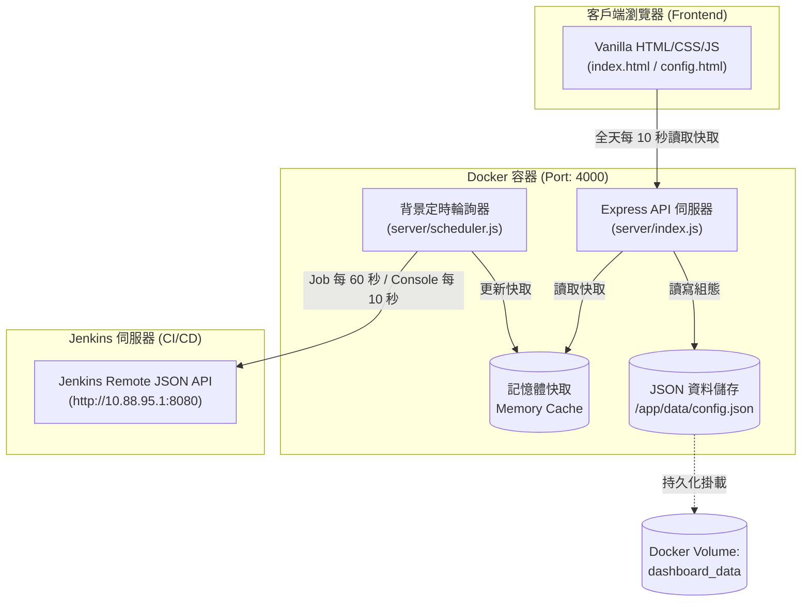

# Jenkins Test Farm Dashboard (測試農場即時監控儀表板)

一個專為 Jenkins CI/CD 測試農場打造的輕量、現代化即時狀態監控儀表板。後端採用 Node.js + Express 代理 Jenkins API 並進行記憶體快取，前端採用純原生 Vanilla HTML/CSS/JavaScript 開發，提供流暢的卡片式視覺化介面，並以 Docker 容器化發布於 **Port 4000**。

---

## 🌟 核心特色 (Features)

- **即時狀態卡片監控**：狀態文字以 `BUILDING` / `IDLE` 清楚區分是否正在執行，色條則保留最近建置結果（綠色：SUCCESS、紅色：FAILURE、琥珀色：UNSTABLE、灰色：ABORTED / DISABLED / NOT BUILT）。
- **執行中 Console 摘要**：Build 執行時每 10 秒透過 Jenkins `progressiveText` API 漸進抓取新增 log，卡片在 `BUILDING` 下方完整換行顯示最新 Robot Framework TEST CASE，並固定保留 `PASS` / `FAIL` / `SKIP` / `NOT RUN` 結果標籤；進入 `IDLE` 後自動隱藏。
- **最新完成測試閃爍提示**：所有卡片中「最近一筆完成」的測試，會在完成後的 **8 小時內**持續以光暈脈動閃爍，並加上「🆕 剛完成」標籤；工具列同步顯示對應的提示標籤，即使該卡片目前不在顯示中的頁面也不會錯過。
- **靈活網格佈局**：支援 `3x3`、`4x4`、`5x5` 網格維度即時切換，並將選擇保存在目前瀏覽器，重新整理及背景資料輪詢都不會改回其他尺寸。畫面固定為一個視窗高度、永不出現捲軸；`3x3` 模式隱藏建置趨勢色條並優先顯示「上次費時」，其他模式則依空間自動收起次要資訊列。
- **自動分頁輪播**：當監控卡片數量超出當前網格容量時，自動進行平滑換頁輪播（預設 30 秒，可由 `settings.autoRotateInterval` 調整）；只有一頁時不輪播。
- **建置趨勢圖表**：每張卡片皆內嵌基於 HTML5 Canvas 的最近 10 次建置趨勢圖，無需依賴肥大第三方圖表庫。
- **自訂別名與拖曳排序**：支援在設定頁面以 HTML5 原生拖曳 API 調整卡片順序，並可即時編輯自訂別名 (Alias)。
- **全天候狀態監控**：前端全天每 10 秒讀取最新快取，隨時顯示卡片的 IDLE / BUILDING 狀態與執行中的 Console 內容。
- **深淺色主題切換**：內建 Light / Dark 主題模式，使用者偏好自動儲存於 `localStorage`。
- **全域組態與資料持久化**：單一全域 JSON 設定檔 (`/app/data/config.json`)，透過 Docker Volume 實現重啟後設定不遺失。
- **安全代理機制**：後端隔離 Jenkins 憑證，密碼遮罩傳輸，前端不直連 Jenkins。

---

## 📸 介面截圖 (Screenshots)

### 即時監控儀表板 (Dashboard)
```
+-------------------------------------------------------------------------------+
| Jenkins Test Farm Dashboard            [3x3] [4x4] [5x5]  [🌙 Theme] [⚙ Config]|
+-------------------------------------------------------------------------------+
| +---------------------+ +---------------------+ +---------------------+     |
| | Job-Build-Smoke     | | Job-Regression-E2E  | | Job-Device-Farm-A   |     |
| | SUCCESS             | | FAILURE             | | IN PROGRESS         |     |
| | Last Success: 5m ago| | Last Success: 2h ago| | Last Success: 10m ag|     |
| | Duration: 3m 42s    | | Duration: 12m 10s   | | Duration: 1m 05s    |     |
| | [ Trend: ▂▃▅▆▇  ]   | | [ Trend: ▇▆▅▃▂  ]   | | [ Trend: ▃▄▅▆   ]   |     |
| +---------------------+ +---------------------+ +---------------------+     |
| +---------------------+ +---------------------+ +---------------------+     |
| | Job-Device-Farm-B   | | Job-API-Contract    | | Job-Performance-Run |     |
| | SUCCESS             | | SUCCESS             | | FAILURE             |     |
| | Last Success: 1m ago| | Last Success: 8m ago| | Last Success: 1d ago|     |
| | Duration: 4m 15s    | | Duration: 45s       | | Duration: 45m 12s   |     |
| | [ Trend: ▃▃▃▃▃  ]   | | [ Trend: ▄▄▄▄▄  ]   | | [ Trend: ▂▂▂▂▂  ]   |     |
| +---------------------+ +---------------------+ +---------------------+     |
|                               Page 1 / 2 (Auto-rotate 30s)                    |
+-------------------------------------------------------------------------------+
```

*(可在此處放置實際部署後的截圖 `docs/screenshots/dashboard.png` 與 `docs/screenshots/config.png`)*

---

## 🚀 快速開始 (Quick Start with Docker Compose)

建議使用 **Docker Compose** 進行部署，可自動掛載資料卷並設定環境變數。

### 1. 啟動服務
在專案根目錄下執行：
```bash
docker-compose up -d
```

### 2. 查看容器狀態與日誌
```bash
# 查看運行狀態
docker-compose ps

# 查看即時日誌
docker-compose logs -f
```

### 3. 開啟瀏覽器
- **監控儀表板**: [http://localhost:4000](http://localhost:4000)
- **管理設定頁面**: [http://localhost:4000/config.html](http://localhost:4000/config.html)

### 4. 停止與重啟
```bash
# 停止服務
docker-compose down

# 重新建置映像檔並啟動
docker-compose up -d --build
```

> [!NOTE]
> 專案固定運行於 **Port 4000**，避免與 Jenkins 預設的 8080 或常見 Node.js 的 3000 發生衝突。

---

## 🛠️ 本機手動安裝與執行 (Manual Installation)

若欲在沒有 Docker 的本機環境執行：

### 需求條件
- **Node.js**: 20.0.0 或以上版本
- **npm**: 9.0.0 或以上版本

### 安裝步驟
```bash
# 1. 安裝生產依賴套件
npm install

# 2. 啟動開發模式 (支援檔案變更熱重載 --watch)
npm run dev

# 或以生產模式啟動
npm start
```

服務啟動後，本機即可透過 `http://localhost:4000` 存取。

---

## ⚙️ 設定指南 (Configuration Guide)

首次進入系統請先至 **設定頁面 (`/config.html`)** 進行初始化設定：

### 1. Jenkins 連線設定 (Jenkins Connection)
- **Jenkins URL**: 輸入 Jenkins 主機位置（例如 `http://10.88.95.1:8080/`）。
- **Username / API Token (Password)**: 輸入具備唯讀權限的 Jenkins 帳號與密碼或 API Token。
- **測試連線 (Test Connection)**: 點擊按鈕後，後端會向 Jenkins 發送測試請求驗證憑證是否有效。
- **儲存設定 (Save)**: 儲存至後端 `config.json`，密碼在前端取得設定時會自動遮罩保護。

### 2. 卡片管理 (Card Management)
- **瀏覽與搜尋 Job**: 系統會自動列出 Jenkins 頂層所有 Jobs，可透過搜尋框快速篩選名稱。
- **新增監控卡片**: 勾選欲監控的 Job 並加入卡片清單。
- **自訂顯示名稱 (Alias)**: 點擊卡片名稱即可直接就地編輯別名（如將 `mobile-android-ci-daily-nightly-run` 簡化為 `Android Nightly`）。
- **拖曳調整順序 (Drag & Drop)**: 滑鼠長按卡片即可上下拖曳調整順序，順序會自動即時同步並儲存。
- **刪除卡片**: 點擊刪除按鈕並確認後即可將卡片自監控看板移除。

### 3. 儀表板偏好設定 (Settings)
- **預設網格 (Grid Size)**: 設定首次開啟看板時的網格規格（`3x3`、`4x4` 或 `5x5`）；使用者在工具列選擇後，以該瀏覽器保存的尺寸為優先。

---

## 📡 API 介面文件 (API Documentation)

所有 API 均以 `/api/` 為前綴，請求與回應主體皆為標準 JSON 格式。

| HTTP 方法 | API 路徑 | 說明 | 備註 |
|:---|:---|:---|:---|
| `POST` | `/api/jenkins/test` | 測試 Jenkins 連線狀態與憑證正確性 | Body: `{ url, username, password }` |
| `POST` | `/api/jenkins/save` | 儲存 Jenkins 連線憑證與 URL | 寫入 `data/config.json` |
| `GET` | `/api/jenkins/config` | 取得當前 Jenkins 連線設定 | 密碼欄位回傳遮罩 |
| `GET` | `/api/jenkins/jobs` | 取得 Jenkins 頂層所有 Job 清單 | 供設定頁面選取 |
| `GET` | `/api/dashboard/data` | 取得所有監控卡片的最新快取建置資料 | 以 jobName 為 key 的物件 |
| `GET` | `/api/dashboard/state` | **前端儀表板輪詢此端點**：一次取得 cards + 建置資料 + settings + `serverTime` | 單次往返，`serverTime` 供前端校正看板機時鐘偏移 |
| `POST` | `/api/cards` | 新增一個監控卡片 | Body: `{ jobName }`；重複的 jobName 會回傳既有卡片 |
| `PUT` | `/api/cards/:id` | 更新指定卡片內容（如別名） | Body: `{ alias }`；僅 `alias` 可被修改 |
| `DELETE` | `/api/cards/:id` | 刪除指定卡片 | 需帶卡片 ID |
| `PUT` | `/api/cards/reorder` | 批次更新所有卡片排序 | Body: `{ cardIds: [...] }` |
| `GET` | `/api/settings` | 取得系統與顯示設定 | 同時作為 Docker Health Check 端點 |
| `PUT` | `/api/settings` | 更新系統與顯示設定 | Body: `{ gridSize, autoRotateInterval }`；`gridSize` 僅接受 `3x3`/`4x4`/`5x5`，`autoRotateInterval` 限 5–600 秒，非法值會被忽略 |

---

## 🏛️ 系統架構概覽 (Architecture Overview)



### 架構設計亮點
1. **API 隔離與安全代理**：前端完全不直連 Jenkins，所有連線由後端 Express 代理，防止 Jenkins 憑證暴露於客戶端。
2. **記憶體快取與負載緩解**：後端 Scheduler 每 60 秒同步 Jenkins Job 狀態；只有執行中的 Build 會每 10 秒漸進讀取新增 console 內容，首次最多載入最後 64 KB。前端瀏覽器每 10 秒直接讀取伺服器快取，不會因電視牆數量增加而對 Jenkins 產生等比例負載。
3. **無依賴前端**：不使用 React/Vue/Webpack 等構建工具，原生 JavaScript、CSS Custom Properties 與 HTML5 Canvas，體積輕巧、載入極速。
4. **單一儲存結構**：所有卡片與連線設定以結構化 JSON 保存在 `data/config.json`，透過 Docker Volume `dashboard_data` 實現跨重啟持久化。

---

## 💻 開發指南 (Development Instructions)

### 專案結構
```
d:\CICD_ROBOT\TestFarmDashBoard\
├── server/
│   ├── index.js        # Express 伺服器入口點 (Port 4000)
│   ├── jenkins.js       # Jenkins API 封裝 (Basic Auth, Job / Build 查詢)
│   ├── store.js         # JSON 檔案儲存層 (讀寫 data/config.json)
│   ├── scheduler.js     # 背景定時輪詢器與記憶體快取模組
│   └── routes.js        # RESTful API 路由分發
├── public/              # 前端靜態資源
│   ├── index.html       # 監控儀表板主畫面
│   ├── config.html      # 設定與卡片管理畫面
│   ├── css/
│   │   └── style.css    # 核心樣式、設計變數、主題與 Grid 系統
│   └── js/
│       ├── dashboard.js # 儀表板輪詢、畫布圖表繪製與自動分頁輪播
│       └── config.js    # 設定頁邏輯、拖曳排序與 CRUD 操作
├── data/                # 本機資料儲存目錄 (Docker 容器掛載至 /app/data)
├── Dockerfile           # 多階段輕量化 node:20-alpine 映像檔建置檔
├── docker-compose.yml   # 容器編排檔
├── package.json         # 專案依賴 (express, uuid)
├── .dockerignore        # Docker 建置排除清單
└── README.md            # 專案說明文件
```

### npm Scripts
- `npm start`: 執行 `node server/index.js`（生產環境入口）。
- `npm run dev`: 執行 `node --watch server/index.js`（Node 20+ 原生檔案監視開發模式）。

---

## ❓ 常見問題與疑難排解 (Troubleshooting)

### Q1: 看板顯示「連線逾時」或無法取得 Jenkins 資料？
1. 請確認後端容器與 Jenkins 主機的網路互通性（若 Jenkins 運行於公司內網，確認防火牆或 VPN 設定）。
2. 至 `/config.html` 點擊「Test Connection」檢查回傳的錯誤訊息。
3. 確認 Jenkins 帳號是否具備足夠的讀取權限 (Job Read)。

### Q2: 重啟 Docker 容器後，設定是否會遺失？
不會。`docker-compose.yml` 以 Bind Mount 將專案目錄下的 `./data` 掛載至容器內的 `/app/data`，所有新增卡片與設定均持久化儲存於 `data/config.json`。設定檔採「先寫暫存檔再 rename」的原子寫入，程序若在寫入途中中斷也不會留下損毀的 JSON。

> ⚠️ 若部署於 **Linux** 主機：容器以非 root 使用者 (uid 1001) 執行，而 bind mount 會沿用主機端目錄的擁有者。若 `./data` 為 root 所有，容器將無法寫入設定。請先執行 `sudo chown -R 1001:1001 ./data`，或改用 Named Volume。Windows / Docker Desktop 無此問題。

### Q3: 看板是否會在平日晚上或週末更新？
會。看板全天候顯示卡片狀態，前端每 10 秒讀取後端快取；瀏覽器頁籤從背景恢復時也會立即刷新。

### Q4: 容器 Health Check 失敗 (unhealthy)？
可檢查容器內部 `/api/settings` 是否正常回應：
```bash
docker exec -it test-farm-dashboard wget -qO- http://localhost:4000/api/settings
```
並確認本機 4000 連接埠未被其他服務佔用。

### Q5: 「最新完成」的閃爍卡片是怎麼判定的？可以調整時間嗎？
- **判定方式**：比較所有卡片「最近一次**已完成**建置」的完成時間（Jenkins 的 `timestamp` 是**開始**時間，因此完成時間 = `timestamp + duration`），取其中最新的那一張。仍在執行中的建置不列入計算。
- **持續時間**：完成後 8 小時內持續閃爍，超過即自動停止。想調整請修改 `public/js/dashboard.js` 最上方的：
  ```js
  const RECENT_HIGHLIGHT_MS = 8 * 60 * 60 * 1000;  // 8 小時
  ```
- **同時只會有一張卡片閃爍**（最新的那一筆）。若它落在其他頁面，工具列的「🆕 最新完成」標籤仍會顯示其名稱與完成時間。
- 若作業系統開啟了「減少動態效果 / Reduce Motion」，閃爍會自動改為靜態的高亮外框。

---

## 📄 授權條款 (License)

本專案基於 [MIT License](LICENSE) 授權發布。
